  

<h4 align="right">
  &lt;TechQuanta Co-Founder&gt;
  &lt;Software Engineer&gt;
  &lt;Content Creator&gt;
</h4>

I love exploring new advancements and solving complex problems through programming. For me, technology is a journey where I seek the alpha of knowledge, adapt to the beta of change, and embrace the gamma of endless possibilities. Every challenge excites me, every new concept fuels my curiosity, and 

</a>

<!--- Tech Stack Array -->

   
  &nbsp;&nbsp;&nbsp;&nbsp;
   
  &nbsp;&nbsp;&nbsp;&nbsp;
   
  &nbsp;&nbsp;&nbsp;&nbsp;
   
  &nbsp;&nbsp;&nbsp;&nbsp;
  
  &nbsp;&nbsp;&nbsp;&nbsp;
   
  &nbsp;&nbsp;&nbsp;&nbsp;
   
  &nbsp;&nbsp;&nbsp;&nbsp;
   
   
  &nbsp;&nbsp;&nbsp;&nbsp;
   
  &nbsp;&nbsp;&nbsp;&nbsp;

   
  &nbsp;&nbsp;&nbsp;&nbsp;
   
  &nbsp;&nbsp;&nbsp;&nbsp;
   
  &nbsp;&nbsp;&nbsp;&nbsp;
   
  
  &nbsp;&nbsp;&nbsp;&nbsp;
   
  &nbsp;&nbsp;&nbsp;&nbsp;
  
   
  &nbsp;&nbsp;&nbsp;&nbsp;
   
  &nbsp;&nbsp;&nbsp;&nbsp;
   
  &nbsp;&nbsp;&nbsp;&nbsp;
   
  &nbsp;&nbsp;&nbsp;&nbsp;
   
  &nbsp;&nbsp;&nbsp;&nbsp;
   
   
  &nbsp;&nbsp;&nbsp;&nbsp;
  
  &nbsp;&nbsp;&nbsp;&nbsp;
   

  

<!--- Footer -->

  <h2><strong>~$</strong> If you change the way you look at things, the things you look at change.</h2> 

### "— WAYNE DYER"

